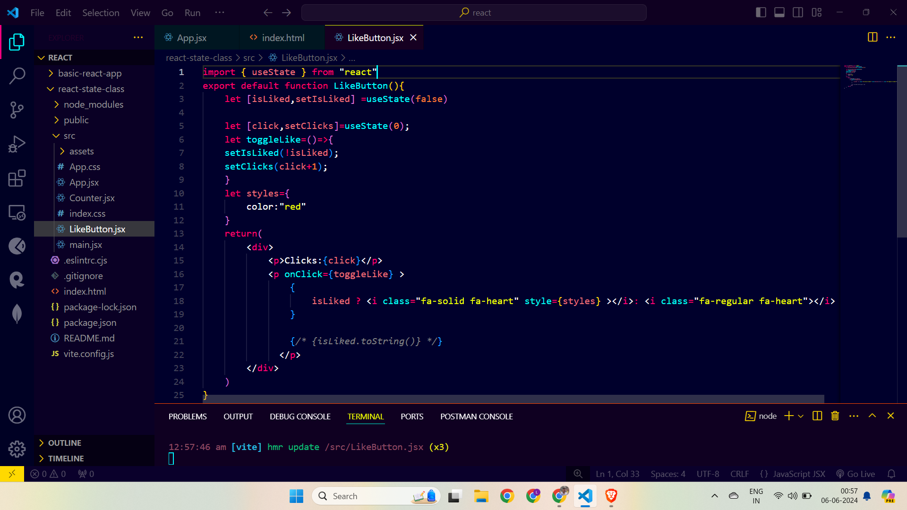
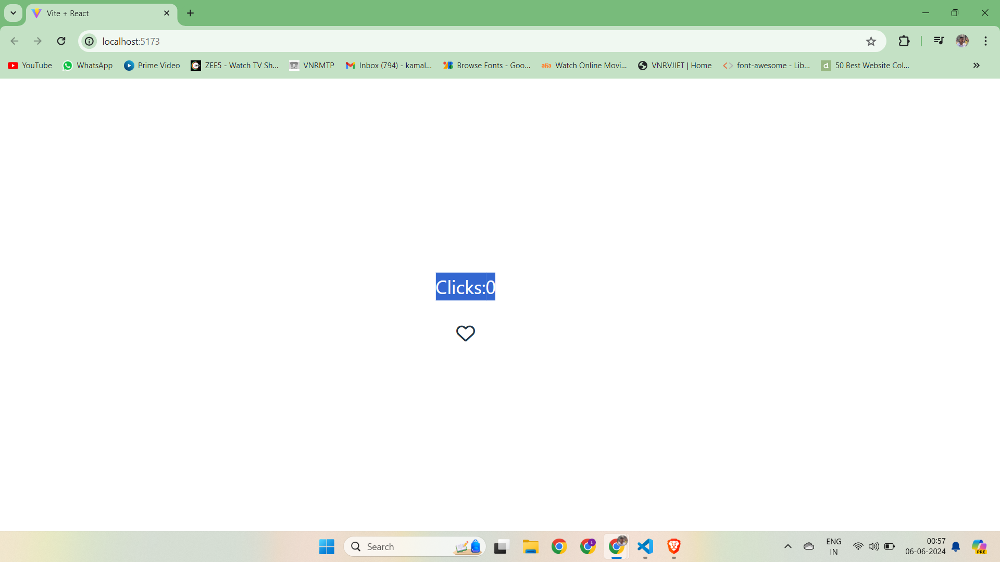
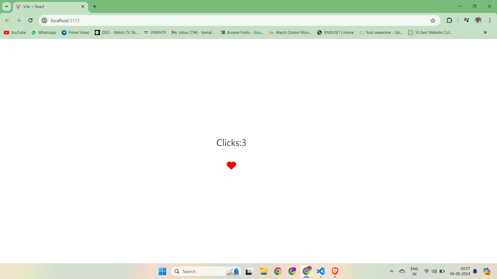

# LikeButton-React

## Like Button Component

This project contains a simple React component called `LikeButton`. The component renders a like button with a heart icon that changes its state when clicked, tracking the number of clicks and whether the button is in a "liked" state or not.

## Table of Contents

- [Installation](#installation)
- [Usage](#usage)
- [Component Details](#component-details)
  - [State](#state)
  - [Functions](#functions)
  - [Styles](#styles)
- [Dependencies](#dependencies)
- [License](#license)

## Installation

To use this component, follow these steps:

1. Make sure you have Node.js and npm installed on your system.
2. Create a new React project or use an existing one.
3. Copy the `LikeButton` component code into a new file, e.g., `LikeButton.js`.

```bash
npx create-react-app my-app
cd my-app
```

4. Add the Font Awesome library to your project for the heart icons.

```bash
npm install @fortawesome/fontawesome-free
```

5. Import Font Awesome in your `index.js` or `App.js` file:

```javascript
import '@fortawesome/fontawesome-free/css/all.css';
```

## Usage

You can use the `LikeButton` component in any part of your React application. Simply import the component and include it in your JSX.

```javascript
import React from 'react';
import LikeButton from './LikeButton';

function App() {
  return (
    <div>
      <h1>My Like Button App</h1>
      <LikeButton />
    </div>
  );
}

export default App;
```

## Component Details

### State

The `LikeButton` component uses two pieces of state:
- `isLiked`: A boolean that tracks whether the button is in a "liked" state.
- `click`: A number that tracks the total number of times the button has been clicked.

### Functions

- `toggleLike`: This function toggles the `isLiked` state between `true` and `false` and increments the `click` state by 1 each time it is called.

### Styles

The component includes a simple style object to change the color of the heart icon when it is in the "liked" state.

```javascript
let styles = {
  color: "red"
};
```

## Dependencies

This component relies on Font Awesome for the heart icons. Ensure you have the `@fortawesome/fontawesome-free` package installed and properly imported.

```bash
npm install @fortawesome/fontawesome-free
```

Import Font Awesome in your main file (e.g., `index.js` or `App.js`):

```javascript
import '@fortawesome/fontawesome-free/css/all.css';
```

## License

This project is licensed under the MIT License. You are free to use, modify, and distribute this component as you see fit.

---

Feel free to customize this README file according to your project's specific requirements.

## Demonstration






